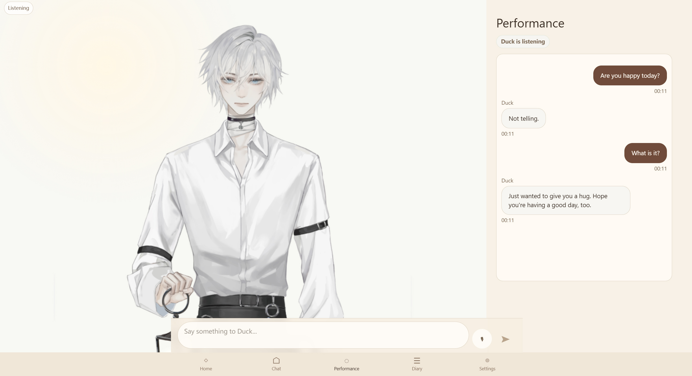
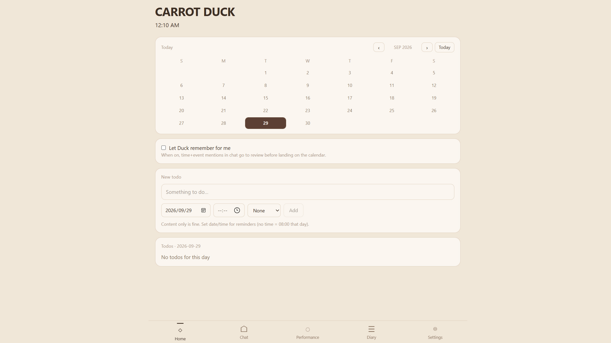
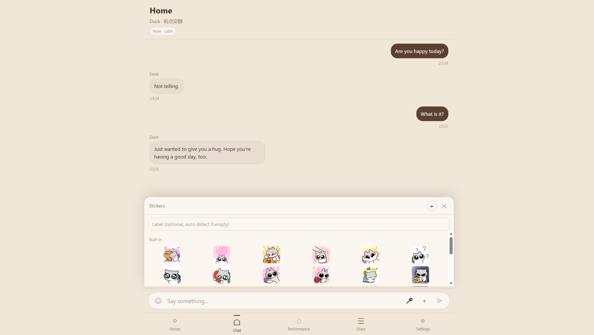
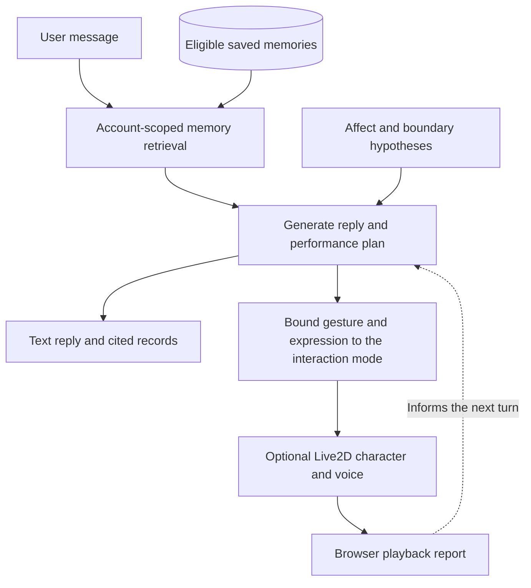

# CARROT DUCK

A web-based AI companion prototype for studying perceived personal recognition.

I developed CARROT DUCK to explore when an AI companion's recollection feels personally meaningful, and when it feels intrusive. Earlier conversations inform replies expressed through chat and a Live2D character. A configurable personality and an experimental relationship model guide how the companion engages with the user.

[Project website](https://shiruifu.online/projects/carrot-duck/) · [Developer demonstration on YouTube](https://youtu.be/8uiZaVtBBH4)

This repository is a runnable research prototype, with backend source and a small local interface for autonomous conversation. Follow the setup instructions below to run it with your own provider credentials. The full hosted application is at [carrotduck.online](https://carrotduck.online/); its accounts and data are separate from a local installation.

Start with the video below. [From the video to the current prototype](docs/DEMO.md#from-the-video-to-the-current-prototype) connects the recorded exchange to steps you can run locally and questions for a future study. The [system notes](docs/AGENT_SYSTEMS.md) explain personality adaptation, affective confidence and relationship policies.

## Demonstration

<a href="https://youtu.be/8uiZaVtBBH4"></a>

[](https://youtu.be/8uiZaVtBBH4)

Cover: the hosted Performance interface. Click the image to watch the developer demonstration.

**[Watch the developer demonstration on YouTube](https://youtu.be/8uiZaVtBBH4).** In this prepared sequence, Duck recalls an earlier encounter with a cat and uses its fox ears as part of a playful response. The recording shows the deployed interface; the autonomous mode in this repository was added later. [Demo notes](docs/DEMO.md) include a second frame and explain what the recording demonstrates.

### Interface gallery

| Home | Chat | Performance |
| --- | --- | --- |
| [](docs/images/home.jpg) | [](docs/images/chat.jpg) | [](docs/images/performance.jpg) |

Screenshots supplied by the developer from the hosted application. Click a frame to view it at full size. The public repository starts with a smaller local account and autonomous interaction interface; it does not include the hosted application's compiled front end.

## What is in this repository

The source includes the dialogue service, memory retrieval, relationship and boundary policies, and character performance controller. Research services record candidate moments of perceived personal recognition (PPR) for examination alongside the user's response. These records support analysis; a system-assigned label does not establish that a user felt recognized.

| Part of the project | Role and release scope |
| --- | --- |
| Personality adaptation | Configurable character traits undergo bounded, rule-based changes in the original chat route. The local autonomous demo reads the existing settings without updating them. |
| Affect and uncertainty | Text cues inform an appraisal state and an affective signal with evidence and a heuristic confidence score. These scores have not been calibrated as probabilities of correct emotion recognition. |
| Memory and provenance | Stored details carry source and confidence metadata. Autonomous retrieval selects eligible records and checks the reply's cited IDs. |
| Relationship and boundaries | The wider dialogue services track familiarity, explicit relationship cues and decaying boundary pressure to guide later responses. |
| Expression within a turn | The performance controller coordinates a reply with a supported gesture, facial expression and optional voice. This is the character layer used to present the interaction. |
| Research records | Candidate recognition events and subsequent reaction labels support review in the wider prototype. The local autonomous route keeps its own retrieval and playback traces. |

[Agent systems and research questions](docs/AGENT_SYSTEMS.md) explains how these mechanisms are implemented, which routes use them, and what remains to be evaluated.

The local interface opens the autonomous interaction mode. It retrieves eligible memories from the current account, generates a reply and a bounded performance plan, and shows the records cited by the model. The plan combines a gesture with a facial expression and an optional change to the character's ears. Browser playback reports can inform the next turn. Daily conversation uses smaller movements than the performance setting.

For each autonomous reply, a reviewer can compare the cited memory with the generated wording and selected gesture. This helps identify a correct recollection presented awkwardly, or an expressive reply that misreads its source. See [Architecture](docs/ARCHITECTURE.md) for the autonomous path and the wider research services.

## Duck as the character example

The current Live2D controller supports nodding, head turns, gaze shifts and facial expression through the model's available parameters. Duck's rig also provides the ear and blush controls used in the character example. In voiced turns, the main gesture starts with audio playback and releases when the turn ends or is interrupted.

| Interaction | Current autonomous behavior |
| --- | --- |
| A reply draws on a saved memory | The reply includes source IDs; a remembered smile is available when the plan cites a memory. |
| The exchange calls for comfort | The plan can select a concerned expression and use a lower movement intensity. |
| A playful invitation fits the exchange | The controller can reveal the ears or offer a head-pat pose, subject to the plan's invitation and boundary checks. |
| The user declines | The plan switches to a restrained listening response and hides the ears. |

These are supported behaviors, not a fixed script for every matching utterance. Another Live2D model needs compatible controls or adjusted mappings. A future 3D version could explore full-body posture, spatial orientation and reaching toward objects, but would require a new animation adapter and scene interaction logic. No 3D implementation is included. [Character capabilities and extension notes](docs/CHARACTER.md) describe this boundary.

## Autonomous interaction flow



The diagram shows the autonomous path exposed by the local interface. Memories enter this path through the explicit save form. Playback reports describe browser execution; they do not measure the user's reaction.

## Run locally

Use Node.js 24 or newer and npm.

```sh
git clone https://github.com/carrotduck/carrot-duck.git
cd carrot-duck
npm ci
```

Copy `.env.example` to `.env`, add your own `DEEPSEEK_API_KEY`, then run:

```sh
npm start
```

Open <http://127.0.0.1:3002>, create a local test account and continue to autonomous interaction. Save an invented experience with the memory form, then ask a related question. Open the inspect panel to compare the reply with its cited source and selected performance.

Keep the server running while using that address: `127.0.0.1` refers to your own computer. On Windows, `start-local.cmd` starts it after installation and configuration. A “connection refused” message usually means the server has not started or has stopped.

Text interaction works without character assets. The model shown in the video is not included. To use a licensed model or enable speech, follow [Running and configuration](docs/RUNNING.md). The local entry page replaces the deployed application's bundled interface; the research and administration services are included as APIs.

| Experience | What you need |
| --- | --- |
| Text replies, memory retrieval and plan inspection | Node.js, installed dependencies and a valid DeepSeek API key |
| Animated character | A licensed Cubism 4-compatible model, with parameter mappings checked for that rig |
| Spoken replies | An ElevenLabs API key and voice ID |

Loading another model does not guarantee every gesture or expression will work. Standard head, eye and mouth controls are used where available; custom controls such as ears and blush need model-specific mappings. This release does not automatically adapt the action library to a new model.

## Tests

```sh
npm test
```

Tests use synthetic fixtures and temporary databases. They cover memory boundaries, account isolation, reply planning, playback cancellation and prepared scenes. They do not require provider keys. Passing these tests checks software behavior, not PPR outcomes or perceived naturalness.

## Current limitations

Retrieval and generation can misinterpret a memory. Source IDs help trace a response but do not verify its meaning. The character controller depends on the parameters available in each model; this version plans one main gesture per turn and does not support arbitrary objects or physical robot movement. The autonomous page saves new long-term memories only through its explicit memory form.

The project is implemented in JavaScript with Node.js, Express, SQLite and Live2D. There is no Unity or Unreal Engine project in this release.

## License and attribution

Original code and documentation are available under the [MIT License](LICENSE). Third-party dependencies and artwork depicted in screenshots have their own terms; see [Third-party notices](THIRD_PARTY_NOTICES.md). Conversation databases, private memory records, model files and provider credentials are excluded.

Project by [Shirui Fu](https://shiruifu.online/). Citation metadata is in [CITATION.cff](CITATION.cff).
