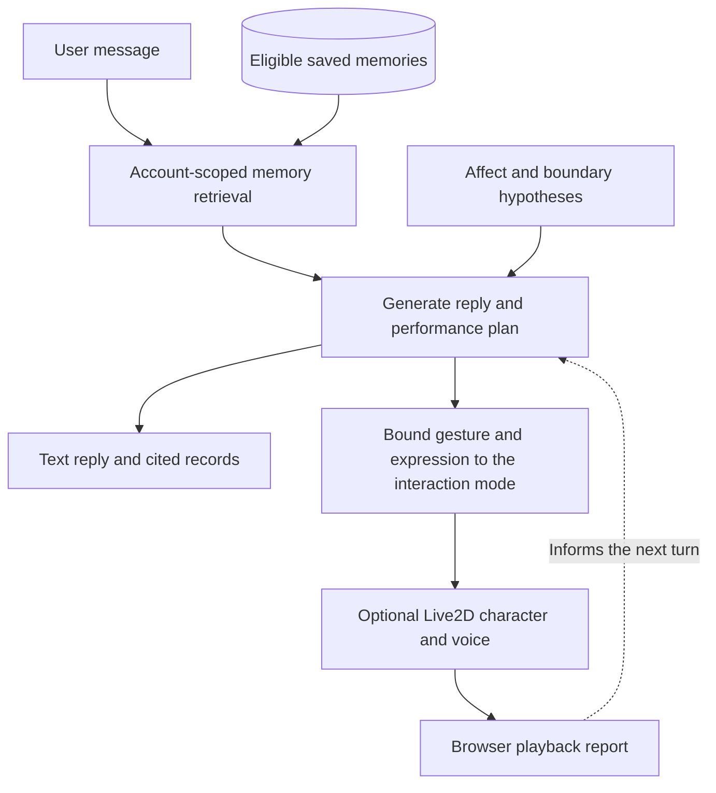

# CARROT DUCK

A web-based AI companion prototype for studying perceived personal recognition.

I developed CARROT DUCK to explore when an AI companion's recollection feels personally meaningful, and when it feels intrusive. Earlier conversations inform replies expressed through chat and a Live2D character. A configurable personality and an experimental relationship model guide how the companion engages with the user.

[Project website](https://shiruifu.online/projects/carrot-duck/) · [Developer demonstration on YouTube](https://youtu.be/8uiZaVtBBH4)

## What is in this repository

The source includes the dialogue service, memory retrieval, relationship and boundary policies, and character performance controller. Research services record candidate moments of perceived personal recognition (PPR) for examination alongside the user's response. These records support analysis; a system-assigned label does not establish that a user felt recognized.

The local interface opens the autonomous interaction mode. It retrieves eligible memories from the current account, generates a reply and a bounded performance plan, and shows the records cited by the model. The plan combines a gesture with a facial expression and an optional change to the character's ears. Browser playback reports can inform the next turn. Daily conversation uses smaller movements than the performance setting.

The YouTube demonstration uses a prepared dialogue sequence to show the conversational interface, management dashboard and Live2D performance. The autonomous mode was added later. See [Demo notes](docs/DEMO.md) for the distinction and [Architecture](docs/ARCHITECTURE.md) for the two interaction paths.

## Autonomous interaction flow



The diagram shows the autonomous path exposed by the local interface. Memories enter this path through the explicit save form. Playback reports describe browser execution; they do not measure the user's reaction.

## Run locally

Use Node.js 24 or newer and npm.

```sh
git clone https://github.com/carrotduck/carrot-duck.git
cd carrot-duck
npm ci
```

Copy `.env.example` to `.env`, add your own `DEEPSEEK_API_KEY`, then run:

```sh
npm start
```

Open <http://127.0.0.1:3002>, create a local test account and continue to autonomous interaction. Save an invented experience with the memory form, then ask a related question. Open the inspect panel to compare the reply with its cited source and selected performance.

Text interaction works without character assets. The purchased model shown in the video is not included. To use a licensed model or enable speech, follow [Running and configuration](docs/RUNNING.md). The local entry page replaces the deployed application's bundled interface; the research and administration services are included as APIs.

| Experience | What you need |
| --- | --- |
| Text replies, memory retrieval and plan inspection | Node.js, installed dependencies and a valid DeepSeek API key |
| Animated character | A licensed Cubism 4-compatible model, with parameter mappings checked for that rig |
| Spoken replies | An ElevenLabs API key and voice ID |

Loading another model does not guarantee every gesture or expression will work. Standard head, eye and mouth controls are used where available; custom controls such as ears and blush need model-specific mappings. This release does not automatically adapt the action library to a new model.

## Tests

```sh
npm test
```

Tests use synthetic fixtures and temporary databases. They cover memory boundaries, account isolation, reply planning, playback cancellation and prepared scenes. They do not require provider keys. Passing these tests checks software behavior, not PPR outcomes or perceived naturalness.

## Current limitations

Retrieval and generation can misinterpret a memory. Source IDs help trace a response but do not verify its meaning. The character controller depends on the parameters available in each model; this version plans one main gesture per turn and does not support arbitrary objects or physical robot movement. The autonomous page saves new long-term memories only through its explicit memory form.

The project is implemented in JavaScript with Node.js, Express, SQLite and Live2D. There is no Unity or Unreal Engine project in this release.

## License and attribution

Original code and documentation are available under the [MIT License](LICENSE). Third-party dependencies and character assets have their own terms; see [Third-party notices](THIRD_PARTY_NOTICES.md). No user conversations, private memories, model files or provider credentials are distributed.

Project by [Shirui Fu](https://shiruifu.online/). Citation metadata is in [CITATION.cff](CITATION.cff).
