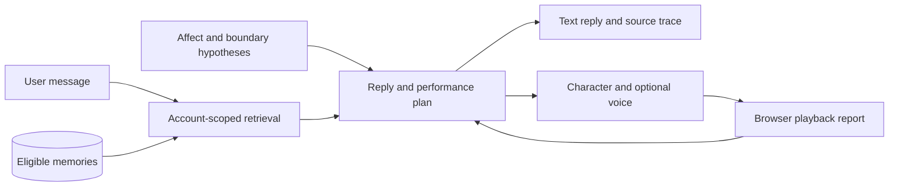

# Architecture

The project asks when recalling a detail from an earlier exchange feels personally meaningful. The implementation separates stored context, response generation and character presentation so these choices can be inspected.

## Autonomous interaction

`src/routes/autonomous.js` owns this path. `src/services/autonomous.js` expands a retrieval query, combines retrieved and recent eligible records, and asks the model for a reply with record IDs and a supported action. References are checked against the supplied candidates. This check catches unknown IDs; it cannot establish that a paraphrase is faithful.

`autonomousPerformance.js` bounds the generated plan using the communication intent, affect hypotheses, refusal state and presentation mode. The plan has one main gesture, an independent facial channel and a limited ear-visibility setting. Repeated high-salience gestures are reduced. The browser's state is supplied as a report, without implying camera perception or awareness of the user's room.

`public/carrot-duck-performance.js` owns preparation, activation and cancellation. In voiced turns, the main gesture starts when audio actually plays. The motion controller blends parameters and returns toward neutral after release. Mouth opening follows speech. Terminal playback reports are stored separately and can inform the next turn; a late report cannot turn a cancelled performance into a completed one.

Autonomous turns and their retrieval traces are stored in `autonomous_turns`. Playback reports are stored in `autonomous_delivery`. This path does not automatically write formal PPR outcomes, update the relationship model or turn every new utterance into a long-term memory. The explicit memory form is the write path exposed in its interface.

## Wider dialogue and research services

The original chat route uses context retrieval, affective signals, relationship policies and expression planning. Modules such as `ppr.js`, `relationalState.js` and `adminAnalytics.js` support recording and reviewing candidate recognition events. Their internal labels are operational categories for inspection. User studies would be needed to assess perceived recognition or naturalness.

Prepared scenes in `rehearsalScenes.js` use separate rehearsal records and explicit progression. They support repeatable developer demonstrations and are not used as a fallback by the autonomous generator. Body-event services are present for the separate rehearsal work; the autonomous page has no physical robot transport.

## Source map

| Area | Starting point |
| --- | --- |
| Server and route registration | `src/index.js` |
| Database schema | `src/db.js` |
| Account sessions and authorization | `src/middleware/security.js` |
| Memory retrieval and provenance | `src/services/memory.js`, `memoryMeta.js` |
| Affect hypotheses | `src/services/occ.js`, `affectiveSignals.js` |
| Autonomous generation and policy | `src/services/autonomous.js`, `autonomousPerformance.js` |
| Character presentation | `public/live2d-demo.html`, `carrot-duck-motion.js`, `carrot-duck-performance.js` |
| Prepared demonstration scenes | `src/services/rehearsalScenes.js` |

## Design references

The project page cites [LPM](https://large-performance-model.github.io/) as an inspiration for coordinating dialogue and performance. The implementation here uses authored Live2D parameter gestures; it does not include an LPM model.

The later performance update drew on [Open-LLM-VTuber's expression mapping](https://github.com/Open-LLM-VTuber/Open-LLM-VTuber/blob/main/src/open_llm_vtuber/live2d_model.py) and [Pipecat's interruption handling](https://docs.pipecat.ai/pipecat/fundamentals/interruptions). The controller in this repository was written for CARROT DUCK; these frameworks are not installed as dependencies.
