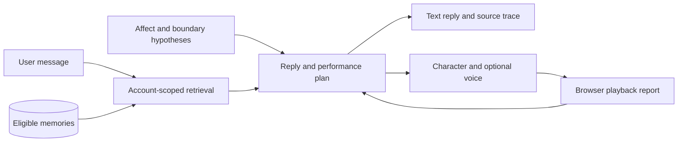

# Architecture

The project asks when recalling a detail from an earlier exchange feels personally meaningful. The implementation separates stored context, response generation and character presentation so these choices can be inspected.

## Autonomous interaction

`src/routes/autonomous.js` owns this path. `src/services/autonomous.js` expands a retrieval query, combines retrieved and recent eligible records, and asks the model for a reply with record IDs and a supported action. Reference checks catch IDs outside the supplied candidates.

`autonomousPerformance.js` bounds the generated plan using the communication intent, affect hypotheses, refusal state and presentation mode. The plan has one main gesture, an independent facial channel and a limited ear-visibility setting. Repeated high-salience gestures are reduced. The browser supplies playback-state reports.

`public/carrot-duck-performance.js` owns preparation, activation and cancellation. In voiced turns, the main gesture starts when audio actually plays. The motion controller blends parameters and returns toward neutral after release. Mouth opening follows speech. Terminal playback reports are stored separately and can inform the next turn; a late report cannot turn a cancelled performance into a completed one.

Autonomous turns and their retrieval traces are stored in `autonomous_turns`. Playback reports are stored in `autonomous_delivery`. The interface exposes an explicit memory form for saving long-term memories. Relationship updates and PPR outcome records belong to the original chat route.

## Wider dialogue and research services

See [Agent systems and research questions](AGENT_SYSTEMS.md) for personality drift, affective confidence, relationship policies and their route-specific limits.

The original chat route uses context retrieval, affective signals, relationship policies and expression planning. Modules such as `ppr.js`, `relationalState.js` and `adminAnalytics.js` support recording and reviewing candidate recognition events. Their internal labels are operational categories for inspection.

Prepared scenes in `rehearsalScenes.js` use separate rehearsal records and explicit progression for repeatable demonstrations. The autonomous generator reports a failure when generation is unavailable. Body-event services support the separate robot rehearsal path.

## Source map

| Area | Starting point |
| --- | --- |
| Server and route registration | `src/index.js` |
| Database schema | `src/db.js` |
| Account sessions and authorization | `src/middleware/security.js` |
| Memory retrieval and provenance | `src/services/memory.js`, `memoryMeta.js` |
| Affect hypotheses | `src/services/occ.js`, `affectiveSignals.js` |
| Autonomous generation and policy | `src/services/autonomous.js`, `autonomousPerformance.js` |
| Character presentation | `public/live2d-demo.html`, `carrot-duck-motion.js`, `carrot-duck-performance.js` |
| Prepared demonstration scenes | `src/services/rehearsalScenes.js` |

## Design references

The project page cites [LPM](https://large-performance-model.github.io/) as an inspiration for coordinating dialogue and performance. CARROT DUCK uses authored Live2D parameter gestures.

The controller was written for CARROT DUCK, with design references to [Open-LLM-VTuber's expression mapping](https://github.com/Open-LLM-VTuber/Open-LLM-VTuber/blob/main/src/open_llm_vtuber/live2d_model.py) and [Pipecat's interruption handling](https://docs.pipecat.ai/pipecat/fundamentals/interruptions).
