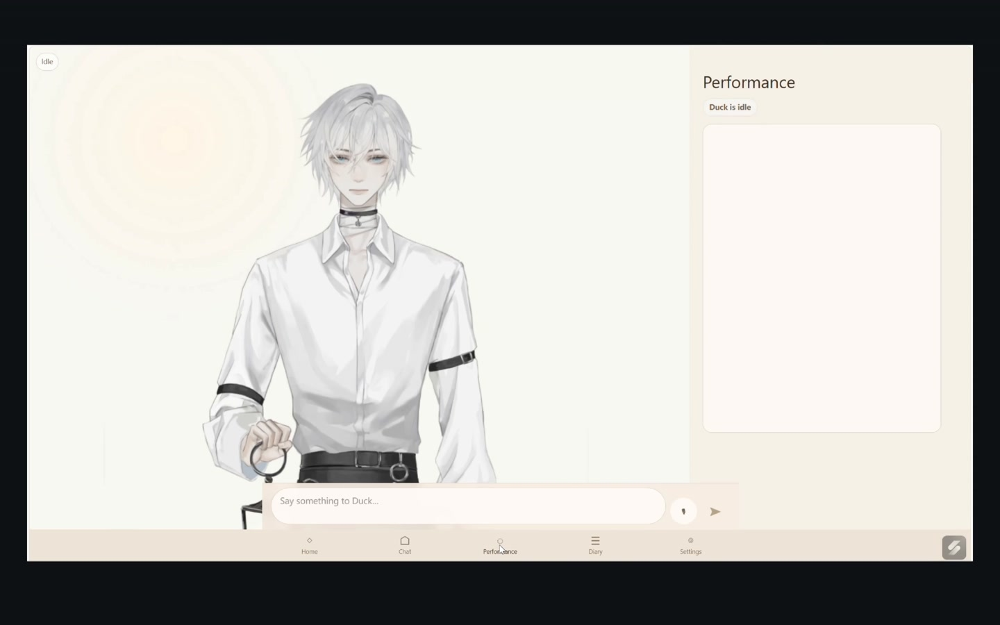
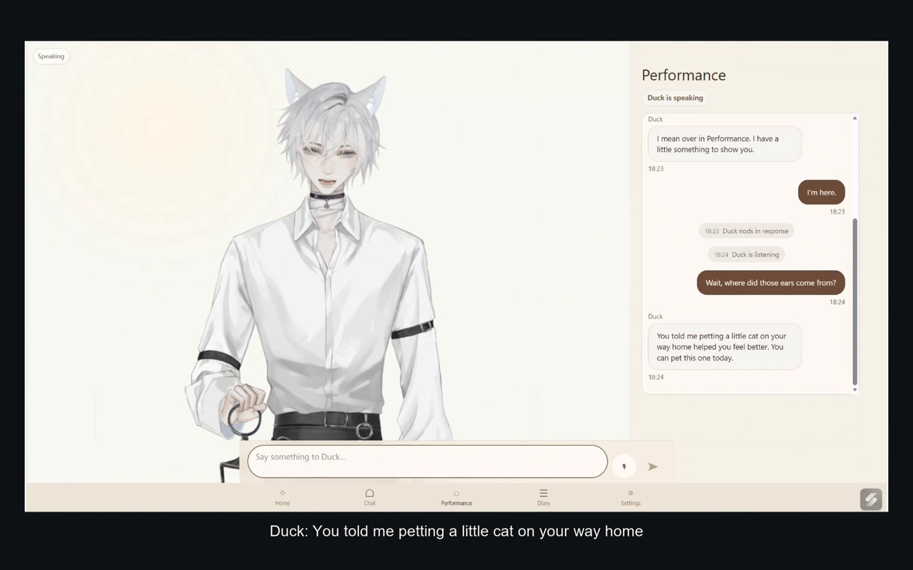

# Developer demonstration

[Watch on YouTube](https://youtu.be/8uiZaVtBBH4) · [Read the project page](https://shiruifu.online/projects/carrot-duck/)

In the video, Duck recalls that petting a cat helped the user feel better, reveals its fox ears and offers a playful response. The recording also shows the conversational interface and management dashboard. This demonstration focuses on a memory cycle, showing how a remembered detail can shape both a reply and the character's expression.

The repository also provides an autonomous interaction mode. It retrieves memories from the current account and generates a reply and performance plan. Its inspector shows candidate memories and the records cited by the model. With a configured character, the browser reports whether playback started, completed, failed or was cancelled. Neither recording a performance nor logging its completion establishes that the user felt recognized.

The public repository includes the web interface and Duck model shown in the recording, as well as an autonomous interaction page. Generated conversations will vary; installing these files does not reproduce the exact dialogue in the video.

## From the video to the current prototype

The video introduces a design question: why might this particular recollection feel personal? The walkthrough lets a reviewer inspect a new generated exchange. The evaluation notes turn that question into comparisons that could be studied.

| Moment in the demonstration video | What to inspect in the current prototype | Question for evaluation |
| --- | --- | --- |
| Duck refers to the earlier encounter with a cat. | Save the walkthrough's invented memory and compare the generated reply with its cited source. | Does the personal reference change perceived recognition, and is it welcome? |
| The reply is accompanied by ears, expression and speech. | Compare the selected performance plan with what the browser actually plays. | How does expression change the interpretation of the same words? |
| The exchange presents a playful invitation. | Try an explicit refusal in the walkthrough and inspect the restricted response. This refusal example is an additional case, not a scene in the video. | When should the character stop recalling a detail or reduce its expressiveness? |

Use the [autonomous walkthrough](AUTONOMOUS_WALKTHROUGH.md) for inputs and inspection steps, and the [evaluation notes](EVALUATION.md) for proposed comparisons. The video focuses on the memory-cycle example; generated replies in the walkthrough will vary.

## Frames from the recording

At approximately 00:57, the character is idle and its ears are hidden. The frame shows the deployed Performance interface before the exchange begins.

At approximately 01:10, Duck speaks about the earlier encounter with a cat, with its ears visible. The spoken invitation connects that detail to the character's presentation. The video shows the timing and transition that a still image cannot convey.

The two frames were extracted from the source recording and resized for documentation. Character artwork remains third-party material; see [image provenance](images/README.md).
